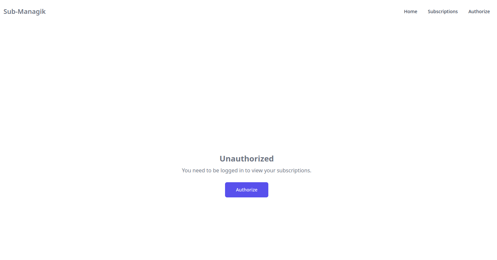

# Subs-Managik App

### Description of Application

This app is for users who have few or a lot of digital services like **Amazon Prime**, **Netflix**, **Starlink**, **Spotify** and others subscriptions and have some trouble management of it.

For peoples who forgoting that fist month of subscription is free and then you must pay money. Or for people that forgot that prices in the future will change. If you want to test some service just for one month, you didn't like it but you forgot to unsubscribe from it and it will take your money until you didn't notice that at your bank mobile app. But with that also a big problem exists. When you see your monthly payments you do not always see what exactly service takes your money. Or you just want to see the amount price of all your services in one place.

So that's all about **Sub-Managik**, an app that was created by people who understand your problems and want to solve them for themselves and other people.

### Table of Contents

1. [How App Looks](#how-app-looks)
2. [Technologies and Libraries Used](#technologies-and-libraries-used)
3. [Architecture](#architecture)
    1. [Application](#application)
    2. [Database Structure and Models](#database-structure-and-models)
        1. [User](#user)
        2. [Subscription](#subscription)
        3. [Service](#service)
        4. [RequestedService](#requestedservice)
    3. [Relationships in Database](#relationships-in-database)
        1. [User and Subscription](#user-and-subscription)
        2. [User and RequestedService](#user-and-requestedservice)
        3. [Subscription and User](#subscription-and-user)
        4. [Subscription and Service](#subscription-and-service)
        5. [Service and Subscription](#service-and-subscription)
        6. [RequestedService and User](#requestedservice-and-user)
    4. [Project Structure](#project-structure)
4. [Getting Started](#getting-started)
    1. [Prerequisites](#prerequisites)
    2. [Installation](#installation)
        1. [Clone the repository](#clone-the-repository)
        2. [Install dependencies for both backend and frontend](#install-dependencies-for-both-backend-and-frontend)
            1. [For Backend](#for-backend)
            2. [For Frontend](#for-frontend)
        3. [Set environment variables](#set-environment-variables)
            1. [For `backend/.env`](#for-backendenv)
            2. [For `frontend/.env`](#for-frontendenv)
    3. [Setup Database](#setup-database)
        1. [Navigate to Backend](#navigate-to-backend)
        2. [Push the database schema to your PostgreSQL database](#push-the-database-schema-to-your-postgresql-database)
        3. [Seed database with required data](#seed-database-with-required-data)
    4. [Running the Application](#running-the-application)
        1. [Start the backend server](#start-the-backend-server)
        2. [Start frontend development server](#start-frontend-development-server)
5. [Contributing](#contributing)
6. [License](#license)

### How App Looks

#### Some images how app frontend part looks in browser:


<div style="text-align: center; margin-bottom: 40px;">
  List of all User Subcriptions
</div>


<div style="text-align: center; margin-bottom: 40px;">
  Add new User Subcription
</div>


<div style="text-align: center; margin-bottom: 40px;">
  Edit User Subcription
</div>


<div style="text-align: center; margin-bottom: 40px;">
  User don't have any Subcriptions
</div>


<div style="text-align: center; margin-bottom: 40px;">
  User profile
</div>


<div style="text-align: center; margin-bottom: 40px;">
  User Registration
</div>


<div style="text-align: center; margin-bottom: 40px;">
  User Login
</div>


<div style="text-align: center; margin-bottom: 40px;">
  User requesting service
</div>


<div style="text-align: center; margin-bottom: 40px;">
  Unauthorized access
</div>


<div style="text-align: center; margin-bottom: 40px;">
  404 page
</div>

### Technologies and libraries I used

I used several technologies to create this app

#### Frontend
- **React v18**
- **Nextjs v14** — using TypeScript
- **Tailwindcss** — styling
- **Flowbite** — UI library
- **Lucide** — Icons
- **Yup** — forms validation
- **React Hook Form** — managing forms
- **Axios** and **Tanstack** — api requests
- **sonner** — beatifull toasts
- **date-fns** — managing dates in app
- **js-cookie** — handling cookies in app

> **NOTE:** List of all dependencies, you can find at **package.json** file at **frontend** folder

#### Backend
- **NestJs v10** — using TypeScript
- **PostgreSQL** — as database
- **Prisma** — as database ORM
- **@nestjs/jwt** and **@nestjs/passport** — managing the authentication and authorization
- **@nestJs/cron** — creating cron jobs
- **cookie-parser** — managing cookies in app
- **node-telegram-bot-api** — as telegram bot api
- **twilio** — SMS integration
- **date-fns** — managing dates in app

> **NOTE:** List of all dependencies, you can find at **package.json** file at **backend** folder

### Architecture

So, i will describe architecture of app, database and folder structure

#### Application

Frontend part as we use **NextJs** has own server and we use our backend wroten on **NestJs** which is separate from out **frontend**. As database we use **PostgreSQL**. Also we have some integrations with **Twilio** for SMS notifications and **Telegram API** for bot notifications for admin about some events, in our case if notifyng admin about new **Requested Services** which missing in our Application. Also we have some

###### So it looks like this:

<div style="text-align:center">
  Application Architecture
</div>

#### Database Structure and Models

#### Models

##### User

The `User` model represents a user in the system.

- **Fields:**
  - `id` (String): Unique identifier, generated using `cuid()`.
  - `name` (String): The user's name.
  - `email` (String): The user's email, unique.
  - `phone` (String, optional): The user's phone number, unique.
  - `password` (String): The user's password.
  - `createdAt` (DateTime): Timestamp when the user was created, defaults to the current date and time.
  - `updatedAt` (DateTime): Timestamp when the user was last updated, automatically set on update.
  - `deletedAt` (DateTime, optional): Timestamp when the user was deleted.
  - `subscriptions` (Subscription[]): List of subscriptions associated with the user.
  - `requestedServices` (RequestedService[]): List of requested services by the user.

- **Table name:** `user`

##### Subscription

The `Subscription` model represents a subscription to a service.

- **Fields:**
  - `id` (String): Unique identifier, generated using `cuid()`.
  - `user` (User): The user who owns the subscription.
  - `userId` (String): Foreign key referencing `User.id`.
  - `service` (Service): The service being subscribed to.
  - `serviceId` (String): Foreign key referencing `Service.id`.
  - `price` (Float): The price of the subscription.
  - `note` (String, optional): Additional notes about the subscription.
  - `isNotifying` (Boolean): Indicates if notifications are enabled for the subscription.
  - `nextPaymentAt` (DateTime): Timestamp for the next payment date.
  - `createdAt` (DateTime): Timestamp when the subscription was created, defaults to the current date and time.
  - `updatedAt` (DateTime): Timestamp when the subscription was last updated, automatically set on update.
  - `deletedAt` (DateTime, optional): Timestamp when the subscription was deleted.

- **Table name:** `subscription`

##### Service

The `Service` model represents a service that can be subscribed to.

- **Fields:**
  - `id` (String): Unique identifier, generated using `cuid()`.
  - `fullName` (String): Full name of the service.
  - `shortName` (String): Short name of the service.
  - `backgroundColor` (String): Background color associated with the service.
  - `subscriptions` (Subscription[]): List of subscriptions associated with the service.
  - `createdAt` (DateTime): Timestamp when the service was created, defaults to the current date and time.
  - `updatedAt` (DateTime): Timestamp when the service was last updated, automatically set on update.
  - `deletedAt` (DateTime, optional): Timestamp when the service was deleted.

- **Table name:** `service`

##### RequestedService

The `RequestedService` model represents a service requested by a user that is not yet available.

- **Fields:**
  - `id` (String): Unique identifier, generated using `cuid()`.
  - `user` (User): The user who requested the service.
  - `userId` (String): Foreign key referencing `User.id`.
  - `name` (String): The name of the requested service.
  - `url` (String): The URL of the requested service.
  - `createdAt` (DateTime): Timestamp when the requested service was created, defaults to the current date and time.
  - `updatedAt` (DateTime): Timestamp when the requested service was last updated, automatically set on update.
  - `deletedAt` (DateTime, optional): Timestamp when the requested service was deleted.

- **Table name:** `requested_service`

#### Relationships in Database

##### User and Subscription

- Each `User` can have multiple `Subscription`s.
- This is represented by the `subscriptions` field in the `User` model.
- The relationship is established through a one-to-many relation.

##### User and RequestedService

- Each `User` can have multiple `RequestedService`s.
- This is represented by the `requestedServices` field in the `User` model.
- The relationship is established through a one-to-many relation.

##### Subscription and User

- Each `Subscription` belongs to a single `User`.
- This is represented by the `user` field in the `Subscription` model.
- The relationship is established through a many-to-one relation.

##### Subscription and Service

- Each `Subscription` is associated with a single `Service`.
- This is represented by the `service` field in the `Subscription` model.
- The relationship is established through a many-to-one relation.

##### Service and Subscription

- Each `Service` can have multiple `Subscription`s.
- This is represented by the `subscriptions` field in the `Service` model.
- The relationship is established through a one-to-many relation.

##### RequestedService and User

- Each `RequestedService` belongs to a single `User`.
- This is represented by the `user` field in the `RequestedService` model.
- The relationship is established through a many-to-one relation.

#### So it looks like this:

<div style="text-align:center">
  Database Structure and Relationships
</div>

#### Project Structure

The project is organized into two main directories:
- `backend`: Contains the server-side using **NestJs** code and database schema.
- `frontend`: Contains the client-side code built with **React** and **Next.js**.
- `docs`: Containes files required for documentation.

```
├─ backend/                         # Root folder for backend
│  ├─ prisma                        # Folder with prisma schema of DB
│  ├─ seeders                       # Folder with seeders for DB
│  ├─ src/
│  |  ├─ auth/                      # Authentication module
│  │  │  ├─ ....                    # Other Authentication module files and folders
│  |  ├─ notifications
│  |  |  ├─ ....                    # Other Authentication module files and folders
│  |  ├─ requested-service
│  |  |  ├─ ....                    # Other Authentication module files and folders
│  |  ├─ service
│  |  |  ├─ ....                    # Other Authentication module files and folders
│  |  ├─ subscription
│  |  |  ├─ ....                    # Other Authentication module files and folders
│  |  ├─ telegram
│  |  |  ├─ ....                    # Other Authentication module files and folders
│  |  ├─ user
│  |  |  ├─ ....                    # Other Authentication module files and folders
│  |  ├─ app.module.ts              # Root module of the application
│  |  ├─ main.ts                    # Entry point of the application
└─ frontend
   ├─ src
   │  ├─ api
   │  │  ├─ ....                    # Files required for making API requests
   │  ├─ app
   │  │  ├─ login
   |  │  ├─  ├─ ....                # Other Login page files and folders
   │  │  ├─ profile
   |  │  │  ├─ ....                 # Other Profile page files and folders
   │  │  ├─ register
   |  │  │  ├─ ....                 # Other register page files and folders
   │  │  ├─ request-service
   |  │  │  ├─ ....                 # Other Request Service page files and folders
   │  │  └─ subscriptions
   |  │  │  ├─ ....                 # Other Subscriptions page files and folders
   │  │  ├─ not-found.tsx           # Not found page in App
   │  │  ├─ page.tsx                # Entry page in App
   │  ├─ components
   |  │  ├─ ....                    # Other UI components files and folders
   │  ├─ config
   |  │  ├─ ....                    # Other constants files used in app
   │  ├─ constants
   |  │  ├─ ....                    # Other constants files used in app
   │  ├─ hooks
   |  │  ├─ ....                    # Other hook files
   │  ├─ services
   |  │  ├─ ....                    # Other services files used in app
   │  └─ types
   |  │  ├─ ....                    # Other types files used in app
   │  ├─ middleware.ts              # Main middleware of App
   ├─ ....                          # Other fronend file
```


### Getting Started

### Prerequisites

Ensure you have the following installed and have the following:

- **Node.js v14+**
- **npm v6+**
- **PostgreSQL v12+**
- **Twilio SMS API credentials**
- **Telegram Bot API credentials**

### Installation

##### Clone the repository

```bash
git clone https://github.com/nkshn/subs-managik-v2.git
cd subs-managik-v2
```

##### Install dependencies for both backend and frontend

###### For Backend:

```bash
cd backend
npm install
```

###### For Frontend:

```bash
cd frontend
npm install
```

##### Set environment variables

Create a `.env` file in the root of both `backend` and `frontend` directories and add the following:

###### For `backend/.env`:

```
DATABASE_URL="DATABES_URL_WITH_USER_AND_PASSWORD"

JWT_SECRET="YOUR_JWT_SECRET"

TELEGRAM_BOT_TOKEN="YOUR_TELEGRAM_BOT_TOKEN"
TELEGRAM_BOT_CHAT_ID="YOUR_TELEGRAM_BOT_CHAT_ID"

TWILIO_ACCOUNT_SID="YOUR_TWILIO_ACCOUNT_SID"
TWILIO_AUTH_TOKEN="YOUR_TWILIO_AUTH_TOKEN"
TWILIO_PHONE_NUMBER="YOUR_TWILIO_PHONE_NUMBER"
```

> **NOTE:** You can find all required credentials at file: **backend/.env.example**

###### For `frontend/.env`:

```
SERVER_URL="http://localhost:5000/api"
APP_DOMAIN_NAME=localhost
```

> **NOTE:** You can find all required credentials at file: **frontend/.env.example**

### Setup Database

##### Navigate to Backend

```bash
cd backend
```

##### Push the database schema to your PostgreSQL database

```bash
npx prisma db push
```

##### Seed database with required data

```bash
npm run seed
```
> **NOTE!** This step is required! Without it, application will have erros on frontend!

### Running the Application

The last step is left just to run the application

##### Start the backend server

```bash
cd backend
npm run start:dev
```

##### Start frontend development server

```bash
cd ../frontend
npm run dev
```

**Congrats, The application should now be running on http://localhost:3000.**


### Contributing
Rules of contributing to project

##### 1. Fork the repository.

##### 2. Create a new branch

```git
git checkout -b feature-branch
```

##### 3. Make your changes and commit them
```git
git commit -am 'Add new feature'
```

##### 4. Push to the branch
```git
git push origin feature-branch
```

##### 5. Create a new Pull Request

### License

ISC